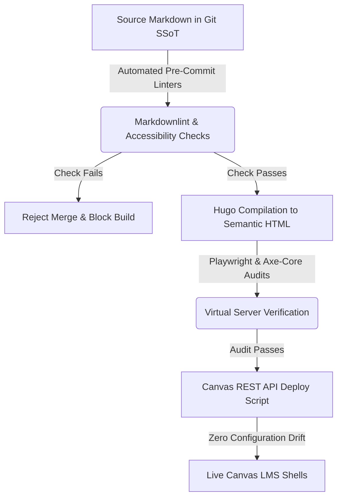

## The Sisyphus of Downstream Remediation

Higher education digital compliance has historically been treated as a downstream janitorial task.

Under traditional workflows, an institution purchases an automated scanning tool that crawls its Learning Management System (LMS), flags thousands of accessibility violations, and generates a massive compliance report. Deans and department chairs then mobilize instructional designers and faculty to manually edit individual course shells through the Canvas Rich Content Editor (RCE). They add missing alt text, re-color text to meet contrast guidelines, and manually rewrite heading hierarchies.

This model is a modern pedagogical equivalent of Sisyphus rolling a boulder up a hill.

The moment a course is copied for a new semester, updated by a faculty member, or modified to include new dynamic links, the manual adjustments drift. The downstream fixes are overwritten, configuration errors re-emerge, and the institution slips back into regulatory non-conformance. The cost is staggering: thousands of hours of skilled labor lost to repetitive, manual corrections that fail to scale.

To satisfy the Department of Justice's **ADA Title II technical mandates (28 CFR Part 35)**, higher education must abandon downstream remediation. Compliance must shift **upstream** into automated, version-controlled software pipelines.

---

## Shifting Upstream: The Curriculum-as-Code Paradigm

The core principle of the upstream shift is simple: **never edit content inside the production environment**.

Instead of treating Canvas as the authoring database, all curriculum content is moved to a version-controlled repository—the **Single Source of Truth (SSoT)**. Under the **Curriculum-as-Code (CaC)** framework, course modules, syllabi, assessments, and laboratory instructions are written in plain, standardized Markdown files.

When a change is required, the curriculum architect modifies the source Markdown file in a local environment and commits the change to a repository hosted on GitHub or GitLab. This local change triggers an automated software pipeline that compiles the Markdown into high-fidelity, semantic HTML and uses the Canvas REST API to overwrite the production shell.

By shifting compliance upstream, the source repository becomes the legal and technical baseline. If the source file is compliant, every downstream instance compiled from it is guaranteed to be compliant.

---

## The Three Pillars of Upstream Architecture

Deploying a functional Curriculum-as-Code pipeline requires three primary architectural components:

### 1. Static Schema and Linter Gates

Before any content is compiled or deployed, it must pass a strict series of automated checks. Static markdown linters (such as `markdownlint` or custom AST parsers) analyze files for structural semantic layout. If a course author attempts to skip a heading level (e.g., placing an `<h3>` directly under an `<h2>` without an intermediate `<h3>` sequence), the linter flags a rule violation and aborts the commit. Automated linters enforce WCAG SC 1.3.1 (Info and Relationships) at the code level, preventing malformed structure from ever entering the codebase.

### 2. Headless Browser Accessibility Regression Testing

Once content compiles locally into static HTML pages, the pipeline spins up a virtual web server and runs automated browser tests using **Playwright** and **Axe-core**. These tests audit page layouts, color contrast values, dynamic calculators, and mobile viewports. If a contrast ratio drops below the institutional master threshold (such as our 9:1 contrast guard) or a link target's bounding box is smaller than 44x44px, the build fails. Compliance is verified deterministically before content reaches students.

### 3. API-Driven State Synchronization (Zero Drift)

The final stage of the pipeline is a deployment script that communicates with the Canvas LMS REST API. Instead of manual copy-pasting, the script authenticated via secure API tokens updates pages, assignments, and modules programmatically. The LMS is treated as a read-only mirror of the Git SSoT. If a user manually alters a page inside the LMS, the next automated commit syncs the state back to the repository baseline, eliminating configuration drift and locking in regulatory compliance.

---

## The Strategic Economics of Automated Governance

The financial and operational arguments for shifting compliance upstream are overwhelming:

| Downstream Manual Remediation | Upstream Automated Pipelines |
| :--- | :--- |
| **High Labor Cost:** Manual course-by-course edits. | **Zero Incremental Cost:** Single-source updates. |
| **Frequent Drift:** Manual updates overwrite compliance. | **Locked State:** API sync resets manual errors. |
| **Vendor Capture:** Proprietary third-party scanner fees. | **Open Tooling:** Open-source Axe-core & Git gates. |
| **Reactive Posture:** Fixing errors after student complaints. | **Proactive Governance:** Catching errors prior to build. |

Shifting compliance upstream transforms digital accessibility from a recurring operational liability into a scalable, auditable technical asset. Higher education leaders who embrace this architectural transition establish permanent compliance, protect their institutions from regulatory action, and reclaim thousands of faculty hours for the core mission of teaching and learning.
