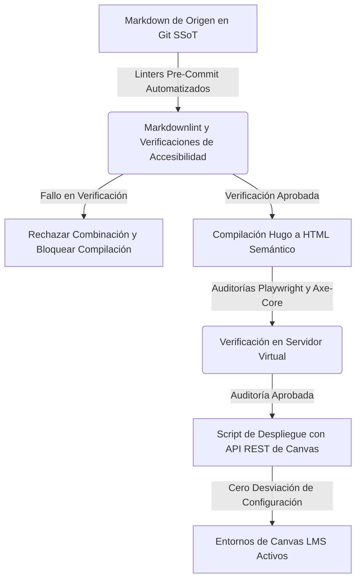

## El Sísifo de la Remediación Aguas Abajo

El cumplimiento digital en la educación superior se ha tratado históricamente como una tarea de limpieza aguas abajo.

Bajo los flujos de trabajo tradicionales, una institución adquiere una herramienta de escaneo automatizado que rastrea su Sistema de Gestión de Aprendizaje (LMS), marca miles de violaciones de accesibilidad y genera un informe de cumplimiento masivo. Los decanos y jefes de departamento movilizan entonces a diseñadores instruccionales y profesores para editar manualmente los cursos individuales a través del Editor de Contenido Enriquecido (RCE) de Canvas. Añaden textos alternativos faltantes, cambian el color del texto para cumplir con las pautas de contraste y reescriben manualmente las jerarquías de encabezados.

Este modelo es el equivalente pedagógico moderno de Sísifo empujando una roca cuesta arriba.

En el momento en que un curso se copia para un nuevo semestre, es actualizado por un profesor o se modifica para incluir nuevos enlaces dinámicos, los ajustes manuales se desvían. Las correcciones realizadas aguas abajo se sobrescriben, reaparecen los errores de configuración y la institución vuelve a caer en el incumplimiento normativo. El costo es asombroso: miles de horas de mano de obra calificada perdidas en correcciones manuales repetitivas que no logran escalar.

Para satisfacer los **mandatos técnicos del Título II de la ADA de la Fiscalía Federal (28 CFR Parte 35)**, la educación superior debe abandonar la remediación aguas abajo. El cumplimiento debe trasladarse **aguas arriba** hacia pipelines de software automatizados y controlados por versiones.

---

## El Cambio Aguas Arriba: El Paradigma de Curriculum-as-Code

El principio fundamental del cambio aguas arriba es simple: **nunca edites contenido dentro del entorno de producción**.

En lugar de tratar al LMS Canvas como la base de datos de autoría, todo el contenido curricular se traslada a un repositorio controlado por versiones: la **Fuente Única de Verdad (SSoT)**. Bajo el marco de **Curriculum-as-Code (CaC)**, los módulos del curso, los programas de estudio, las evaluaciones y las instrucciones de laboratorio se redactan en archivos Markdown estándar y sencillos.

Cuando se requiere un cambio, el arquitecto curricular modifica el archivo Markdown de origen en un entorno local y confirma el cambio en un repositorio alojado en GitHub o GitLab. Este cambio local desencadena un pipeline de software automatizado que compila el Markdown en HTML semántico de alta fidelidad y utiliza la API REST de Canvas para sobrescribir el entorno de producción.

Al trasladar el cumplimiento aguas arriba, el repositorio de origen se convierte en la línea base legal y técnica. Si el archivo de origen es conforme, se garantiza que cada instancia aguas abajo compilada a partir de él sea conforme.

---

## Los Tres Pilares de la Arquitectura Aguas Arriba

Desplegar un pipeline funcional de Curriculum-as-Code requiere tres componentes arquitectónicos principales:

### 1. Compuertas de Esquema Estático y Linters

Antes de que cualquier contenido se compile o se despliegue, debe pasar una serie estricta de verificaciones automatizadas. Los linters estáticos de Markdown (como `markdownlint` o analizadores AST personalizados) analizan los archivos en busca de un diseño semántico estructural. Si el autor de un curso intenta saltarse un nivel de encabezado (por ejemplo, colocar un `<h3>` directamente bajo un `<h2>` sin una secuencia `<h3>` intermedia), el linter marca una violación de regla y aborta la confirmación. Los linters automatizados imponen el criterio de conformidad WCAG SC 1.3.1 (Información y Relaciones) a nivel de código, evitando que la estructura malformada entre en la base de código.

### 2. Pruebas de Regresión de Accesibilidad con Navegadores Headless

Una vez que el contenido se compila localmente en páginas HTML estáticas, el pipeline inicia un servidor web virtual y ejecuta pruebas automatizadas en navegadores utilizando **Playwright** y **Axe-core**. Estas pruebas auditan los diseños de las páginas, los valores de contraste de color, las calculadoras dinámicas y las vistas móviles. Si una relación de contraste cae por debajo del umbral maestro institucional (como nuestro protector de contraste 9:1) o el cuadro delimitador de un enlace es inferior a 44x44px, la compilación falla. El cumplimiento se verifica de forma determinista antes de que el contenido llegue a los estudiantes.

### 3. Sincronización de Estado Impulsada por API (Cero Desviación)

La etapa final del pipeline es un script de despliegue que se comunica con la API REST del Canvas LMS. En lugar de copiar y pegar manualmente, el script, autenticado mediante tokens de API seguros, actualiza páginas, tareas y módulos de manera programática. El LMS se trata como un espejo de solo lectura del Git SSoT. Si un usuario altera manualmente una página dentro del LMS, el siguiente commit automatizado sincroniza el estado de vuelta a la línea base del repositorio, eliminando la desviación de configuración y garantizando el cumplimiento normativo.

---

## La Economía Estratégica de la Gobernanza Automatizada

Los argumentos financieros y operativos para trasladar el cumplimiento aguas arriba son contundentes:

| Remediación Manual Aguas Abajo | Pipelines Automatizados Aguas Arriba |
| :--- | :--- |
| **Alto Costo Laboral:** Edición manual curso por curso. | **Costo Incremental Cero:** Actualizaciones en fuente única. |
| **Desviación Frecuente:** Ediciones sobrescriben el cumplimiento. | **Estado Bloqueado:** Sincronización API restablece errores. |
| **Captura de Proveedor:** Tarifas de escaneo de terceros. | **Herramientas Abiertas:** Compuertas Axe-core y Git libres. |
| **Postura Reactiva:** Corregir tras quejas de estudiantes. | **Gobernanza Proactiva:** Capturar errores antes del despliegue. |

Trasladar el cumplimiento aguas arriba transforma la accesibilidad digital de una responsabilidad operativa recurrente a un activo técnico escalable y auditable. Los líderes de la educación superior que adoptan esta transición arquitectónica establecen un cumplimiento permanente, protegen a sus instituciones de acciones legales y recuperan miles de horas docentes para la misión central de la enseñanza y el aprendizaje.
